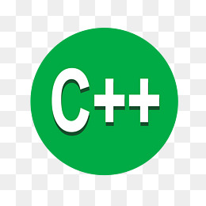
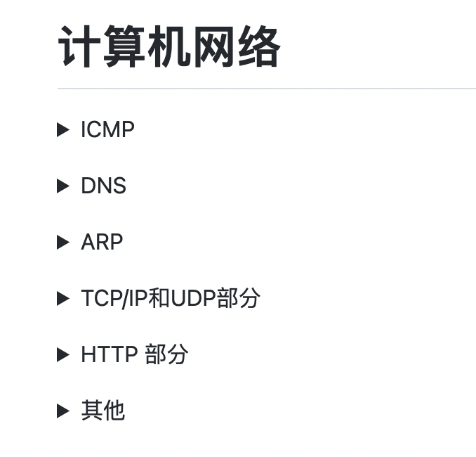
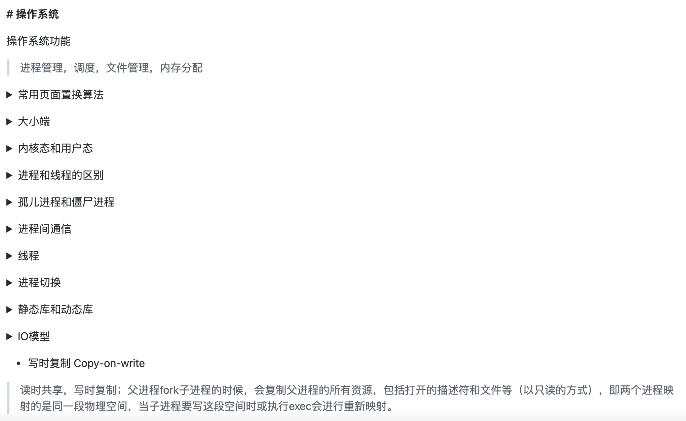

# welcome to my github

* 自己整理的c++后端面试笔记，时间仓促，可能会有很多错误

|                          计算机网络                          |                           操作系统                           |                            linux                             |                        C++&&数据结构                         |                            数据库                            |                           图像处理                           |
| :----------------------------------------------------------: | :----------------------------------------------------------: | :----------------------------------------------------------: | :----------------------------------------------------------: | :----------------------------------------------------------: | :----------------------------------------------------------: |
|  |  |  |  |  |  |

 

## 计算机网络

</a>

## 操作系统
</a>

## 面经整理
[面经整理](https://github.com/EricOo0/interview_prepare/blob/main/%E9%9D%A2%E7%BB%8F%E6%95%B4%E7%90%86.md)

